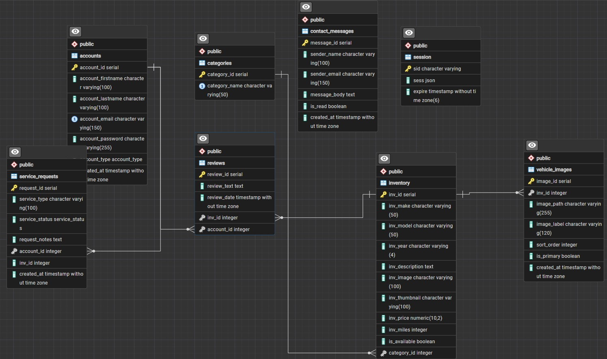

# final-project-cse340

## Tech Stack

- Runtime: Node.js
- Backend framework: Express.js
- Templating engine: EJS
- Module system: ECMAScript Modules (ESM)
- Database: PostgreSQL
- Database client: pg
- Session store: express-session + connect-pg-simple
- Validation: express-validator
- Password hashing: bcrypt
- Development tooling: nodemon, pnpm

## Project Description

This project is a server-rendered car dealership website for customers, employees, and admins. Visitors can browse inventory, view vehicle details, and contact the dealership. Registered users can submit and manage reviews, create service requests, and track request history. Employees can manage inventory details, moderate reviews, and review incoming service and contact activity. Admins can manage categories, inventory, employee accounts, and system-wide data.

## Database Schema

The database schema and relationships are documented in the ERD exported from pgAdmin.

## User Roles

- User: Browse inventory, leave reviews, manage their own reviews, submit service requests, and view their service history.
- Employee: Do everything a user can do, plus update vehicle information, moderate reviews, manage service requests, and review contact submissions.
- Admin: Do everything an employee can do, plus manage categories, inventory records, employee accounts, and system activity data.

## Test Account Credentials

Use the seeded test accounts below. The same shared password is used for all seeded accounts.

- Admin: `admin@example.com`
- Employee: `employee@example.com`
- User: `user@example.com`

## Known Limitations

- The employee account list is functional, but account creation and password reset flows are not fully implemented.
- The catalog and detail pages rely on seeded inventory data and image paths being present in the `public/images` folder.
- Some admin and employee pages use simplified forms and tables instead of a full back-office workflow.
- There is no automated test suite included for runtime verification.

## Local Development

1. Create a .env file with:
	- DB_URL (or DATABASE_URL)
	- SESSION_SECRET
	- NODE_ENV=development
2. Install dependencies:
	- pnpm install
3. Start app:
	- pnpm dev

## What The App Uses

- MVC-style structure in src/controllers, src/models, and src/views
- Role-aware authentication and dashboards (User, Employee, Admin)
- EJS-rendered pages for home, auth forms, inventory, reviews, service requests, and admin/employee views
- PostgreSQL-backed persistence for accounts, inventory, reviews, service requests, contact messages, and sessions
- Server-side validation for form input and session-based flash messaging

## Notes

- Source code uses ESM imports/exports only (no CommonJS in app code).
- Database connection accepts either DB_URL or DATABASE_URL.